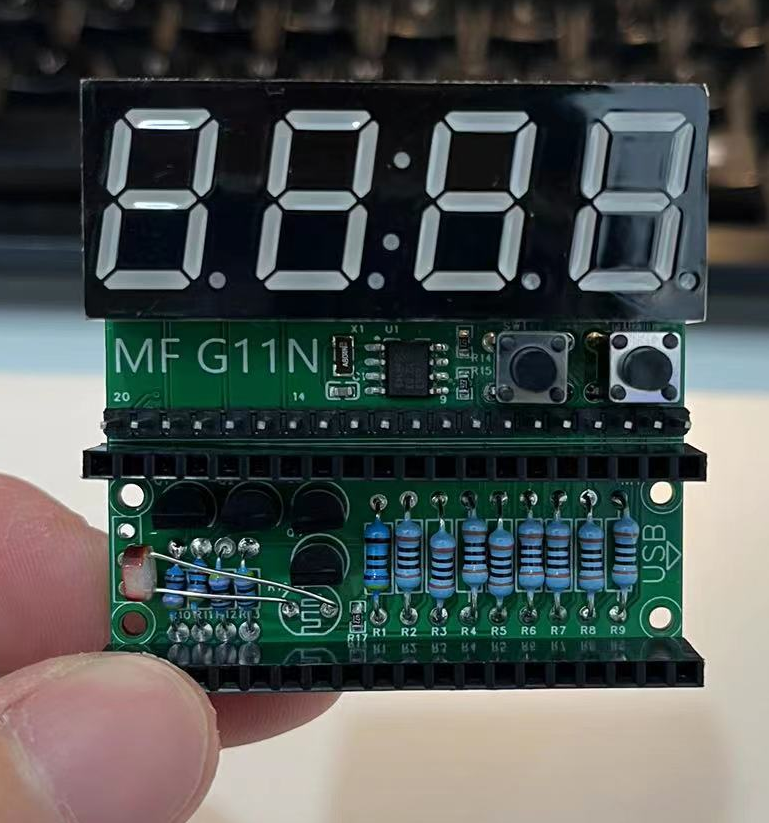
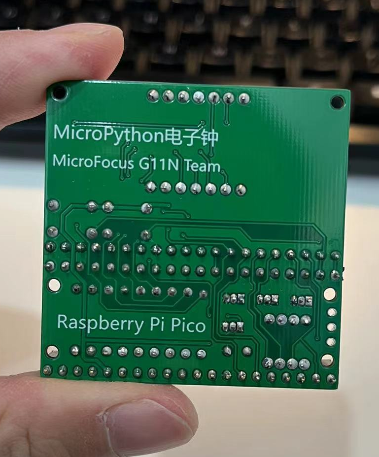
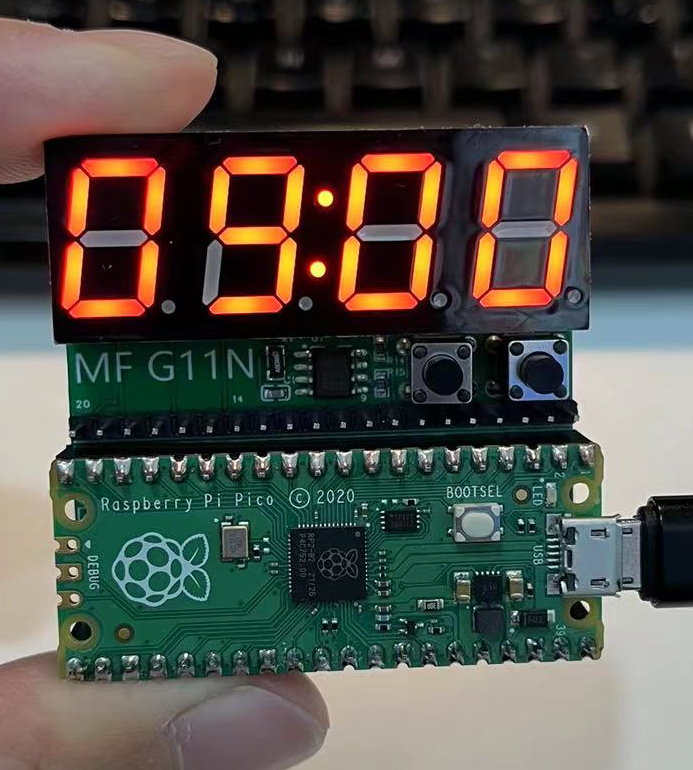

# MicroPythonClock
MicroPython clock with Raspberry Pi Pico.

The Python/main.py is the final python script that works.  

Refer to: https://www.raspberrypi.com/documentation/microcontrollers/micropython.html to learn how to use MicroPython on Raspberry Pi Pico  

And the Thonny is a super simple tool to develop MicroPython with Raspberry Pi Pico: https://projects.raspberrypi.org/en/projects/getting-started-with-the-pico/2  

# Images
Front:  

Back:  

Front with pico:  

